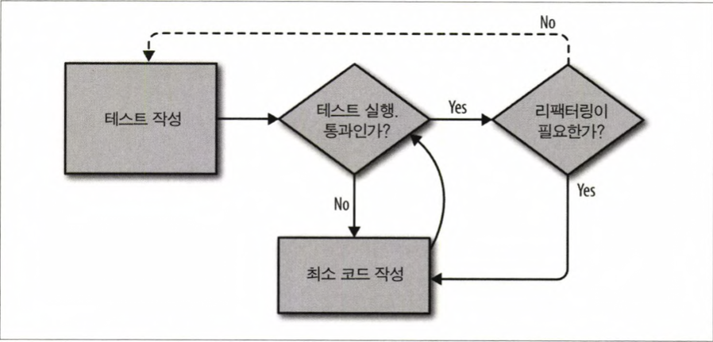
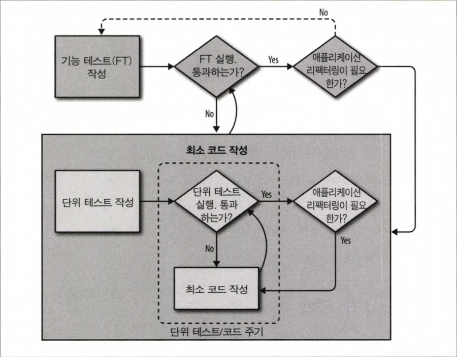

## chap 04 왜 테스트를 하는 것인가?

- #### 왜 테스트를 하는것인가? 

  > 테스트를 과하게 하는것은, 확장되는 서비스의 작업 효율을 높여준다. 하지만 대부분의 책이나, 다양한 test 관련 발표들을 들어보면 때에 따라 적용하는게 좋으며, 나중에 확장될 때 세부적인 테스트를 해도 좋다는 언급을 보았음
  >
  > - 테스트에 대한 역설적인 이야기
  >
  >   _..TDD의 문제는 ...유연하지 않다는 것이다. ... 스타트업에서는 사업의 방향 전환이 매우 잦다....... 세세하게 만들어둔 테스트 케이스들은 수정하는데 시간이 너무 많이 들어가게 된다...._

- #### 상수 관점의 테스트 진행

  > `<html>` 같은 태그의 경우도 고정값. 고정 값은 의미가 없다. __단위 테스트는 흐름제어, 조직, 설정같은 부분을 테스트한다.__ 템플릿의 경우 django 에서 제공하는 _render_함수를 통해 파일 형태로 보관하여 구문 검증이 가능하다.

- #### 전체적인 TDD 프로세스

  1. 테스트 작성 (실패하는 테스트 코드)
  2. 테스트를 통과하는 최소 코드 작성
  3. 리팩토링 

  

  ##### 기능 + 유닛테스트 병합의 경우 FLOW

  > 기능 테스트를 상위 관점으로 두고 테스트를 진행한다. 

  

  

## 새로 알게 된 점

#### Selenium 셀레늄 기능

> 웹 브라우저의 자동화를 제공해주는 도구. 브라우저 상의 사용자가 상호작용을 하거나, 웹 브라우저에서 상호 교환 가능한 코드를 작성할 수 있도록 지원해준다. 

- ##### find_element_by_

  > 셀리늄 드라이버로 접속한 페이지에서 id , tag, class 등 다양한 값을 가져올 수 있는 함수.

- ##### send_keys

  > 사용자가 enter, ctrl의 특수키 입력이 필요할 경우 전송한다. 
  >
  > `from selenium.webdriver.common.keys import Keys` 가 필요하다.

#### find_element VS find_elements

element는 1개를 찾는데, 값이 없다면 _Exception_ 을 반환한다. 하지만 Elements의 경우 값이 없다면 _Empty list_ 를 반환한다. 

| Find Element                                                 | Find Elements                                                |
| :----------------------------------------------------------- | :----------------------------------------------------------- |
| Returns the first most web element if there are multiple web elements found with the same locator | Returns a list of web elements                               |
| Throws exception NoSuchElementException if there are no elements matching the locator strategy | Returns an empty list if there are no web elements matching the locator strategy |
| It will only find one web element                            | It will find a collection of elements whose match the locator strategy. |
| Not Applicable                                               | Each Web element is indexed with a number starting from 0 just like an array |


#### generator expression vs list comprehension

_파이썬을 잘 모르는 사람을 위해 간단히 설명하면, 이 함수들은 Generator Expression 으로 list comprehension 과 비슷하지만 더 진보된 기술이다. 이것에 관한 자료를 찾 아 읽어볼 것을 권한다._

https://stackoverflow.com/questions/47789/generator-expressions-vs-list-comprehension

```python
# Generator expression
(x*2 for x in range(256))

# List comprehension
[x*2 for x in range(256)]
```

*generator expression* 또는 *list expression* 의 결과는 동일한 작업을 수행하는 기능이다. 하지만 메모리 사용의 차이가 있다.

```python
 gen():
    return (something for something in get_some_stuff())
  
print gen()[:2]     # generators don't support indexing or slicing
print [5,6] + gen() # generators can't be added to lists
```

*생성기 표현식* 은 항목에 접근?하므로 매우 한번의 참조는 좋지만, index slicing 또는 다른 가공 작업이 불가능하다. 

이런 차이를 고려해서 두개를 효율적으로 사용할 수 있다.

> stack overflow 의견이 많이 갈리는것으로 보아, 메모리 효율을 고려할것인지, 가공을 많이 하는지에 비례해서 상황에 따라 적용하면 좋을 것 같다. 
>
> 간단히 이해한 내용은 둘다 결과 값은 같으나, yield를 이용해 인덱스를 접근하느냐, 한번에 새로운 목록을 생성해 버리냐의 차이가 있다. 리스트의 경우 같은 목록을 하나 더 생성하므로, 무한대에 가까운 list라면 GE를 쓰는 것을 권장한다.
>
> https://docs.python.org/3/howto/functional.html#generator-expressions-and-list-comprehensions
>
> _This means that list comprehensions aren’t useful if you’re working with iterators that return an infinite stream or a very large amount of data. Generator expressions are preferable in these situations._

##### any()

- Iterator 이 가능한 객체를 받아, 어느 하나의 값이 True 라면 True 값을 반환한다

##### all()

- Iterator 이 가능한 객체를 받아, 모든 값이 True 라면 True 값을 반환한다

#### django

- ##### render()

  HttpResponse 에 감싸져 데이터가 반환된다.

- ##### render_to_string()

  String 형태의 값으로 반환된다.


## 3. 같이 이야기 하고 싶은 내용

##### 민성

TDD 프로세스 중에 가장 어려운 점은 `Write minimal code` 인 듯 합니다. (?)

> 당연한것도 기본적으로 r, g, y 과정을 거치는게 어렵다. 결과가 눈에 보여서 지양하라니가 의미로 적었다. 


##### 🔥 타이포라 🔥

마크다운 에디터. 최강


## 4. 이해가 안가는 내용

x


#### 참조

https://tech.peoplefund.co.kr/2018/06/07/mastering-django-core-chapter12-testing-in-django.html

https://www.guru99.com/find-element-selenium.html

https://stackoverflow.com/questions/47789/generator-expressions-vs-list-comprehension

https://www.python.org/dev/peps/pep-0289/#id8

https://docs.python.org/3/howto/functional.html#generator-expressions-and-list-comprehensions